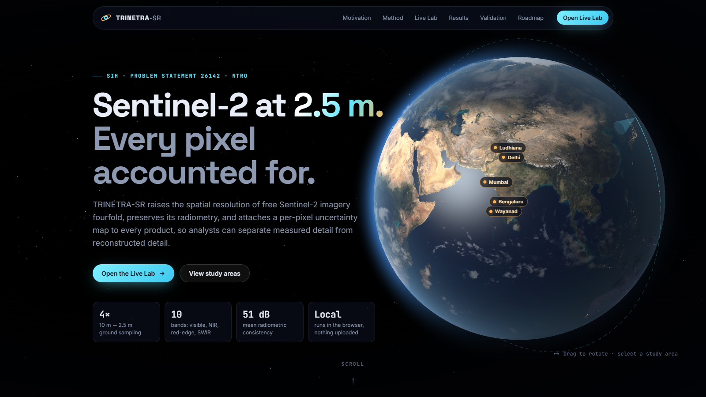
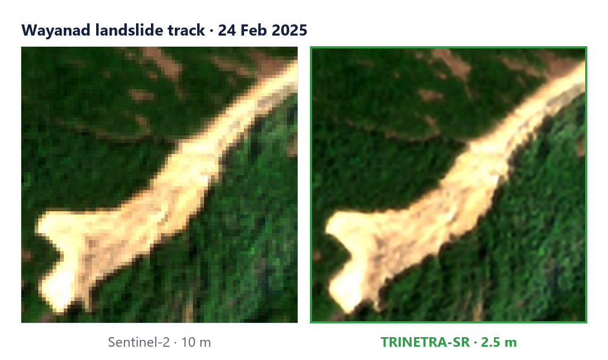
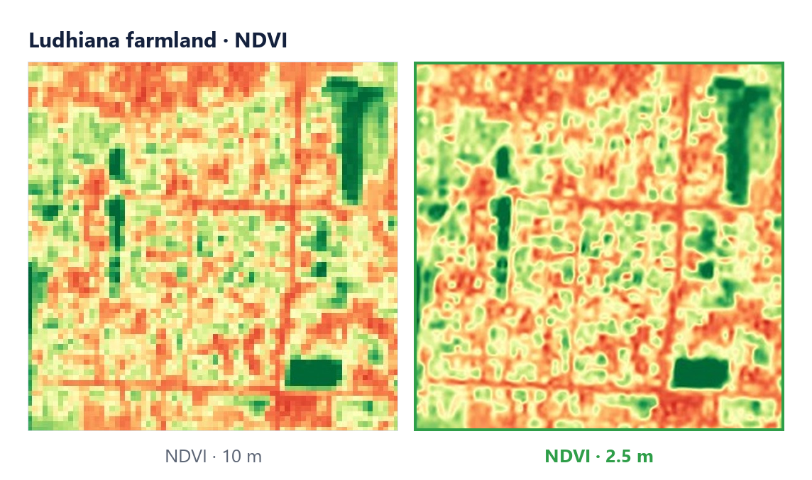

<div align="center">

# TRINETRA-SR

**Trustworthy super-resolution for Sentinel-2: 10 m → 2.5 m, with every pixel accounted for**

[](https://uchihadzoro.github.io/Deep-Learning-Super-Resolution-Mapping/)
[](TECHNICAL_DESIGN.md)
[](IMPLEMENTATION_PLAN.md)

Smart India Hackathon 2026 · Problem Statement 26142 · National Technical Research Organisation · Team Sentinels_W



</div>

---

## Overview

Sentinel-2 images every land surface on Earth every five days, free of charge. At 10 m per pixel, though, roads, rooftops, field boundaries and localised damage blur into their surroundings.

TRINETRA-SR raises Sentinel-2 imagery to **2.5 m on all ten 10 m and 20 m bands** while keeping it faithful to what the satellite measured, and it attaches a **per-pixel uncertainty map** to every product so analysts can separate observed detail from reconstructed detail.

The complete pipeline (scene search, super-resolution, uncertainty, validation and GeoTIFF export) runs **inside the browser**. Nothing is uploaded, and no server is required.


---

## Key capabilities

| | |
|---|---|
| **4× super-resolution** | 10 m → 2.5 m on B02–B08, B8A, B11, B12 |
| **Radiometric fidelity** | Frequency-domain hard constraint; degrading the output reproduces the input at > 49 dB |
| **Per-pixel uncertainty** | 8-fold dihedral test-time ensemble, exported as a GeoTIFF layer |
| **Automatic validation** | Consistency PSNR, spectral angle, NDVI deviation, sharpness gain for every product |
| **Any location** | Place search, cloud-aware selection of the clearest Sentinel-2 L2A scene |
| **GIS-ready output** | 10-band GeoTIFF in the source UTM projection, with uncertainty and input layers |
| **Runs anywhere** | 19 MB ONNX model in the browser (WebAssembly / WebGPU); Python batch and FastAPI/Docker options |

---

## How it works


The v1 network is **SEN2SR-Lite** (ESA OpenSR, CC0-1.0). Its low-frequency hard constraint

$$\hat{y} = y + \mathcal{F}^{-1}\!\left[ M \odot \mathcal{F}\big(U(x) - y\big) \right]$$

takes the low frequencies of the output from the measurement itself, so the network can add detail but cannot change measured radiometry. We exported it to ONNX by rewriting the FFT and antialiased resampling as exact matrix operations (maximum deviation 9 × 10⁻⁷), which lets it run in any modern browser.

Full details: [TECHNICAL_DESIGN.md](TECHNICAL_DESIGN.md).

---

## Results

Self-consistency on five Indian study areas (8 uncertainty passes):

| Metric | Mean | Range | Target |
|---|---|---|---|
| Consistency PSNR, 10 m bands | **51.1 dB** | 49.2 – 53.1 | > 40 dB |
| Consistency PSNR, 20 m bands | **36.8 dB** | 34.7 – 40.0 | > 33 dB |
| Spectral angle (10 m) | **0.48°** | 0.23 – 0.62 | < 1.5° |
| NDVI deviation (MAE) | **0.0066** | 0.003 – 0.009 | < 0.02 |
| Edge-energy gain vs bicubic | **1.17×** | 1.14 – 1.21 | > 1.1× |
| Pixels flagged as uncertain | **0.05 %** | 0 – 0.19 | < 5 % |

Study areas: Bengaluru, Ludhiana, Mumbai, Wayanad and the Delhi Yamuna floodplain.

<table>
<tr>
<td></td>
<td></td>
</tr>
</table>

> **Scope.** These figures show the output stays faithful to the satellite measurement. They do not show that every reconstructed detail is physically correct; independent high-resolution benchmarking is part of the v2 plan.

---

## Getting started

### Use the web application
Open the **[live demo](https://uchihadzoro.github.io/Deep-Learning-Super-Resolution-Mapping/)**, search for a place, and select **Super-resolve this location**. To try an upload, download the sample scene from the Live Lab and drop it back in.

### Run locally
```bash
python -m http.server 8000 --directory docs
```
Then open http://localhost:8000.

### Batch pipeline (Python 3.11)
```bash
python -m venv .venv
.venv\Scripts\pip install torch --index-url https://download.pytorch.org/whl/cpu
.venv\Scripts\pip install -r requirements.txt
.venv\Scripts\python pipeline\run_sr.py            # all study areas
.venv\Scripts\python pipeline\run_sr.py bengaluru  # one area
```
Outputs are written to `pipeline/outputs/` (GeoTIFFs) and `docs/data/` (viewer assets).

### Server (on-premise / air-gapped)
```bash
docker build -f server/Dockerfile -t trinetra-sr .
docker run -p 7860:7860 trinetra-sr
```

---

## Repository structure

```
├── docs/                   Web application (GitHub Pages)
│   ├── engine.js           In-browser pipeline: search → SR → uncertainty → metrics → GeoTIFF
│   ├── js/                 Globe (Three.js) and application logic
│   ├── model/              SEN2SR-Lite ONNX model (19 MB)
│   └── data/               Pre-computed study areas and sample scene
├── pipeline/               Python batch pipeline and ONNX export
├── server/                 FastAPI service and Dockerfile
├── figures/                Diagrams and result figures
├── TECHNICAL_DESIGN.md     Architecture, model, trust layer, validation
├── IMPLEMENTATION_PLAN.md  Our approach, v1 build and roadmap
└── requirements.txt
```

<details>
<summary>Auto-generated repository diagram</summary>

[](https://gitdiagram.com/uchihadzoro/deep-learning-super-resolution-mapping)

</details>

---

## Roadmap

- [x] 4× SR on all 10 bands with a radiometric consistency constraint
- [x] Per-pixel uncertainty and automatic validation
- [x] Cloud-aware scene search, in-browser inference, GeoTIFF export
- [x] Python batch pipeline and FastAPI/Docker service
- [ ] Fine-tuning on Indian reference imagery (Cartosat, WorldStrat)
- [ ] Multi-temporal fusion of 4–8 revisits
- [ ] Conformal calibration of uncertainty and hallucination audit
- [ ] Independent benchmarks (OpenSR-test, SEN2NAIP) and downstream-task evaluation
- [ ] QGIS plug-in and offline deployment package

See [IMPLEMENTATION_PLAN.md](IMPLEMENTATION_PLAN.md) for phases, timelines and exit criteria.

---

## Scientific note

The 2.5 m product is a model reconstruction, not a native 2.5 m observation. Fine-scale detail may be inferred and should always be read together with the uncertainty layer.

---

## Credits

- **Model:** SEN2SR-Lite, ESA OpenSR (Aybar et al., 2025), CC0-1.0, used as the v1 baseline network.
- **Data:** contains modified Copernicus Sentinel data. Live scenes via Element 84 Earth Search (AWS); study areas via Microsoft Planetary Computer.
- **Maps and search:** Esri World Imagery; Photon place search © OpenStreetMap contributors; globe textures from NASA Blue Marble via three.js.

The data pipeline, uncertainty and validation layer, ONNX export, in-browser engine and web application were developed by Team Sentinels_W for SIH 2026.
