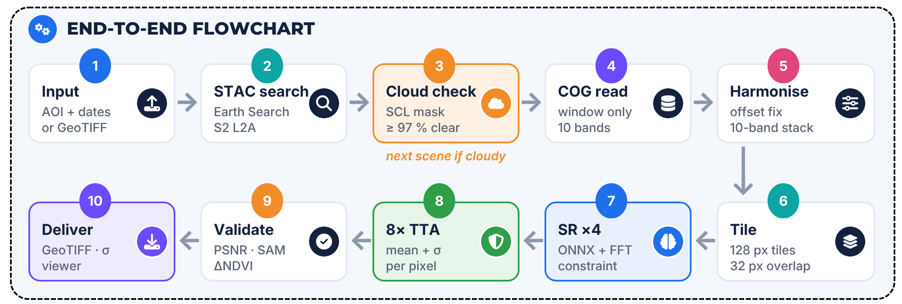
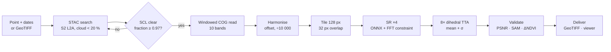
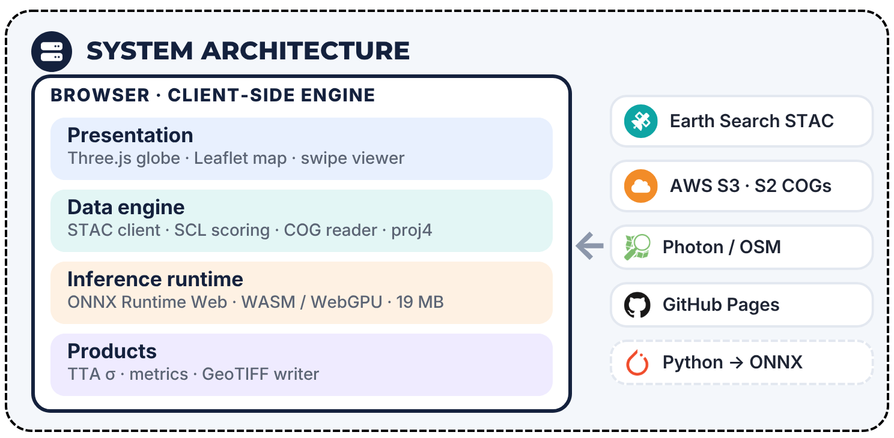
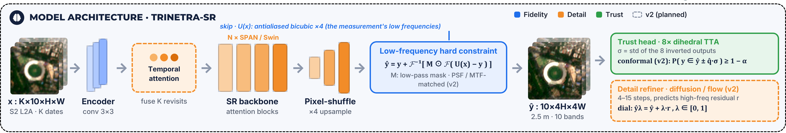
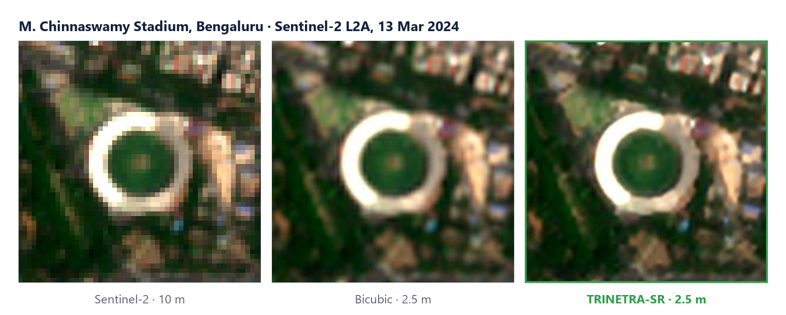

# TRINETRA-SR · Technical Design

**SIH 2026 · PS 26142 (NTRO) · Team Sentinels_W (190286)**
Version 1.1 · Components are marked **v1** (implemented and running) or **v2** (designed, planned).
For the approach and project plan, see [IMPLEMENTATION_PLAN.md](IMPLEMENTATION_PLAN.md).

---

## Contents
1. [Objective](#1-objective)
2. [Inputs and outputs](#2-inputs-and-outputs)
3. [End-to-end pipeline](#3-end-to-end-pipeline)
4. [System architecture](#4-system-architecture)
5. [Model](#5-model)
6. [Trust layer](#6-trust-layer)
7. [Validation](#7-validation)
8. [Code organisation](#8-code-organisation)
9. [Deployment](#9-deployment)
10. [v2 training plan](#10-v2-training-plan)
11. [Limitations](#11-limitations)

---

## 1. Objective

Transform Sentinel-2 L2A imagery from **10 m to 2.5 m** ground sampling (4×) on all ten 10 m and 20 m bands, such that:

| Requirement | Meaning | Mechanism |
|---|---|---|
| **Fidelity** | The output never contradicts the measurement | Frequency-domain hard constraint; native-resolution consistency checks |
| **Detail** | Sub-pixel structure becomes interpretable | Deep SR network (v1); temporal fusion and refiner (v2) |
| **Trust** | Every pixel reports how reliable it is | Dihedral ensemble uncertainty (v1); conformal calibration (v2) |

---

## 2. Inputs and outputs

| | Specification |
|---|---|
| **Input bands** | 10 m: B02, B03, B04, B08 · 20 m: B05, B06, B07, B8A, B11, B12 (bilinearly resampled to the 10 m grid) |
| **Input source** | (a) Point + date range: archive search on Element 84 Earth Search (browser) or Microsoft Planetary Computer (Python). (b) Uploaded GeoTIFF with 10, 12 or 13 bands |
| **Pre-processing** | Scene ranking by SCL cloud-free fraction of the target window (classes 4, 5, 6, 7, 11; threshold 0.97, fallback ≥ 0.6) · baseline ≥ 04.00 offset removal (−1000 DN) · scaling to reflectance (÷ 10 000) · windowed COG reads |
| **Tile size** | 128 × 128 input pixels (1.28 km), 32 px feathered overlap; areas of 1.28, 1.92 or 2.56 km |
| **Output** | 2.5 m 10-band GeoTIFF (source UTM CRS, reflectance × 10 000, uint16) · 2.5 m uncertainty GeoTIFF (σ per band) · 10 m input GeoTIFF · metrics (JSON) · RGB, bicubic and NDVI views |

---

## 3. End-to-end pipeline





---

## 4. System architecture



The same pipeline runs in three environments:

| Environment | Use | Components |
|---|---|---|
| **Browser (v1, primary)** | On-demand analysis, demo, offline use | `docs/engine.js`: STAC client, SCL scoring, COG reader (geotiff.js, proj4), tiler, ONNX Runtime Web (WebAssembly; WebGPU when its output matches WebAssembly), metrics, GeoTIFF writer · `docs/js/`: Three.js globe, Leaflet map, viewer |
| **Python batch (v1)** | Study areas, bulk processing, model export | `pipeline/run_sr.py` (PyTorch, rasterio, Planetary Computer) · `pipeline/export_onnx.py` |
| **Server (v1, optional)** | On-premise / air-gapped API | `server/app.py` (FastAPI job queue) · `server/Dockerfile` |

The browser and Python implementations agree within 0.05 dB on identical scenes.

---

## 5. Model



*Solid outlines are implemented in v1; dashed outlines are planned for v2.*

### 5.1 v1 network: SEN2SR-Lite (pretrained baseline)

v1 uses **SEN2SR-Lite** from ESA OpenSR (Aybar et al., 2025, *Remote Sensing of Environment*), released under CC0-1.0. We use the published weights; v1 does not retrain them.

| Stage | Function | Architecture | Parameters (approx.) |
|---|---|---|---|
| A | B02, B03, B04, B08: 10 → 2.5 m | Lightweight CNN, re-parameterised conv blocks (24 channels) + hard constraint | 0.5 M |
| B | 20 m bands → 10 m grid, guided by the 10 m bands | Reference-guided ×2 CNN + hard constraint | 0.5 M |
| C | 20 m bands → 2.5 m | SPAN (Swift Parameter-free Attention Network), fusing stage-B bands with stage-A RGBN + hard constraint | 0.5 M |

The weights were trained by the OpenSR team on SEN2NAIPv2 (Sentinel-2 ↔ NAIP 2.5 m aerial imagery; 2,851 real cross-sensor pairs and 17,657 synthetic pairs), with CloudSEN12 scenes for the SWIR bands.

### 5.2 Low-frequency hard constraint

For low-resolution input $x$ and raw network output $y$:

$$\hat{y} = y + \mathcal{F}^{-1}\!\left[ M \odot \mathcal{F}\big(U(x) - y\big) \right]$$

where $\mathcal{F}$ is the 2-D DFT, $U$ is antialiased bicubic up-sampling (×4) and $M$ is a low-pass mask. The low frequencies of $\hat{y}$ are taken from the measurement, so the network can only contribute high-frequency detail.

### 5.3 ONNX export for the browser (v1)

Neither `torch.fft` nor antialiased resize has an ONNX operator. `pipeline/export_onnx.py` rewrites both exactly:

- **Antialiased up-sampling** becomes separable resampling matrices computed from the original operator: $U(x) = U_h \, x \, U_w^{\top}$.
- **The FFT constraint** becomes real DFT matrix products (12 matmuls). When the mask is rank-1 ($M = a\,b^{\top}$), it collapses to two matmuls: $A\,D\,B^{\top}$.

| Property | Value |
|---|---|
| Max deviation from PyTorch | 9 × 10⁻⁷ |
| Model size | 19.3 MB |
| Latency, 128 × 128 tile | 0.58 s (native, 1 thread) · ≈ 1.5 s (WebAssembly) |
| End-to-end, 1.28 km area, 4 TTA passes | ≈ 6 s on a laptop CPU (model cached) |

### 5.4 Tiling

The input is cut into 128 px tiles with 32 px overlap. Each tile's output is multiplied by a separable linear ramp weight (0.05 → 1 over the overlap) and accumulated with its weight, then normalised. Small inputs are reflect-padded up to one tile. This replaces the library's tiler, which mis-placed tiles for non-default sizes.

### 5.5 v2 network design

| Component | Design |
|---|---|
| Temporal front-end | K ∈ {4…8} co-registered revisits → shared shallow encoder → attention across time → fused features |
| Backbone | Swin/Mamba-style, 3–15 M parameters |
| PSF/MTF consistency | Per-band Gaussian PSF from the Sentinel-2 MTF specification replaces the generic low-pass mask |
| Detail refiner | Residual diffusion / flow-matching head (4–15 steps) predicting only the high-frequency residual $r$ |
| Fidelity ↔ detail dial | $\hat{y}_\lambda = \hat{y} + \lambda\, r$, with $\lambda \in [0, 1]$ chosen by the user |

---

## 6. Trust layer

| Component | Status | Method |
|---|---|---|
| Ensemble uncertainty | v1 | Run the 8 dihedral transforms (4 rotations × horizontal flip), invert each output, report the per-pixel standard deviation σ for every band |
| Self-consistency validation | v1 | Degrade the output to each band's native grid and compare with the input (Section 7) |
| Conformal calibration | v2 | Split-conformal on held-out HR pairs: $\hat{q}$ = the $\lceil (n+1)(1-\alpha) \rceil / n$ quantile of $\lvert y-\hat{y} \rvert / \sigma$; interval $\hat{y} \pm \hat{q}\sigma$ with coverage ≥ $1-\alpha$ |
| Hallucination audit | v2 | Object detection on SR vs HR reference; count "phantom" objects and verify they fall in high-σ regions |
| Observed vs inferred map | v2 | Per-pixel label from multi-date agreement (observed) vs single-prior reconstruction (inferred) |

Pixels with mean RGB σ > 0.01 reflectance are flagged as high-uncertainty. The viewer renders σ on an inferno colour scale capped at 0.02.

---

## 7. Validation

### 7.1 Metrics (computed automatically for every product)

| Metric | Definition |
|---|---|
| Consistency PSNR, 10 m | SR averaged over 4 × 4 blocks vs input for B02, B03, B04, B08 |
| Consistency PSNR, 20 m | SR averaged over 8 × 8 blocks vs input (2 × 2-averaged) for B05, B06, B07, B8A, B11, B12 |
| Spectral angle (SAM) | Mean angle between degraded-SR and input spectra |
| NDVI deviation | Mean absolute difference between NDVI of degraded SR and NDVI of input |
| Edge-energy gain | Mean gradient magnitude of SR RGB ÷ that of bicubic RGB |
| High-uncertainty share | Fraction of pixels with mean RGB σ > 0.01 |

### 7.2 v1 results (five Indian sites, 8 TTA passes)

| Metric | Min | Max | Mean | Target |
|---|---|---|---|---|
| PSNR, 10 m bands (dB) | 49.15 | 53.09 | 51.12 | > 40 |
| PSNR, 20 m bands (dB) | 34.73 | 39.98 | 36.84 | > 33 |
| Spectral angle, 10 m (°) | 0.23 | 0.62 | 0.48 | < 1.5 |
| Spectral angle, 20 m (°) | 1.51 | 2.02 | 1.77 | < 2.5 |
| NDVI MAE | 0.0033 | 0.0089 | 0.0066 | < 0.02 |
| Edge-energy gain vs bicubic | 1.14× | 1.21× | 1.17× | > 1.1× |
| Pixels with σ > 0.01 (%) | 0.00 | 0.19 | 0.05 | < 5 |

Sites: Bengaluru (13 Mar 2024), Ludhiana (12 Mar 2024), Mumbai (6 Feb 2024), Wayanad (24 Feb 2025), Delhi Yamuna floodplain (30 Oct 2024).



**Scope.** Self-consistency shows that no measured information was altered. It does not show that the reconstructed detail is correct.

### 7.3 v2 reference validation

- **OpenSR-test** (five curated cross-sensor sets): consistency, synthesis and hallucination scores against bicubic, SEN2SR and LDSR-S2.
- **SEN2NAIPv2 cross-sensor split:** PSNR, SSIM, LPIPS and SAM against true 2.5 m NAIP imagery.
- **India reference set:** Cartosat / NRSC tiles (requested via NTRO), 8–10 areas.
- **Downstream tasks:** building IoU and small-building recall, road completeness, field-boundary F1, water-edge accuracy, change-detection F1, each compared across 10 m input, SR 2.5 m and real high-resolution imagery.

---

## 8. Code organisation

```
docs/                     Web application (served by GitHub Pages)
├── index.html            Page structure
├── css/style.css         Styles
├── js/globe.js           Three.js globe, orbit, study-area pins
├── js/app.js             UI: search, Live Lab, viewer, metrics
├── engine.js             In-browser pipeline (search → SR → σ → metrics → GeoTIFF)
├── model/                sen2sr_lite.onnx (19 MB)
└── data/                 Pre-computed study areas and sample GeoTIFF
pipeline/
├── run_sr.py             Batch pipeline: fetch, SR, uncertainty, metrics, export
├── export_onnx.py        Exact ONNX export of the network
└── recompute_metrics.py  Recompute metrics from saved GeoTIFFs
server/
├── app.py                FastAPI job queue (on-premise option)
└── Dockerfile            Container image with weights baked in
figures/                  Diagrams and result figures used in the docs
```

### Server API (`server/app.py`)

| Endpoint | Purpose |
|---|---|
| `GET /api/health` | Status, device, queue length |
| `POST /api/jobs` | Start a job: `{lat, lon, start, end, size, tta}` |
| `POST /api/upload?tta=4` | Start a job from an uploaded GeoTIFF (≤ 60 MB) |
| `GET /api/jobs/{id}` | Progress, stage and result (metrics + download paths) |

---

## 9. Deployment

| Mode | Status | Notes |
|---|---|---|
| Static web app | v1 | GitHub Pages from `docs/`; model cached by the browser; nothing is uploaded |
| Offline / air-gapped | v1-ready | Serve `docs/` from any internal web server, pointing the STAC search at an internal mirror |
| On-premise API | v1 | `docker build -f server/Dockerfile -t trinetra-sr .` then `docker run -p 7860:7860 trinetra-sr` |
| Batch production | v1 | `python pipeline/run_sr.py [area_id]` |

---

## 10. v2 training plan

| Stage | Data | Loss |
|---|---|---|
| Pre-train | SEN2NAIPv2 synthetic (17,657 pairs) + PSF-degraded high-resolution imagery | L1 + FFT + SAM |
| Fine-tune | SEN2NAIPv2 cross-sensor (2,851 pairs) + WorldStrat | Shift-tolerant L1 + light LPIPS + edge loss |
| Domain adaptation | Indian Sentinel-2 scenes (self-supervised consistency) + Indian HR references | Consistency + L1 |
| Calibration | Held-out reference pairs | Split-conformal |

Compute: Kaggle/Colab T4 or P100 and a college GPU; mixed precision; 64 → 256 px patches.

---

## 11. Limitations

- The 2.5 m product is a model reconstruction, not a native 2.5 m observation. Fine detail must be read together with the uncertainty layer.
- The v1 network was trained on US aerial imagery; performance on Indian landscapes is not yet independently measured.
- Uncertainty in v1 reflects model sensitivity to input orientation, not calibrated error bounds. Calibration is a v2 deliverable.
- Live runs need a cloud-free acquisition; persistent cloud cover (monsoon) may yield no suitable scene in the chosen date range.

---

## References

1. Aybar et al. (2025). A radiometrically and spatially consistent super-resolution framework for Sentinel-2. *Remote Sensing of Environment*. https://www.sciencedirect.com/science/article/pii/S0034425725006261
2. Aybar et al. (2024). SEN2NAIP: a large-scale dataset for Sentinel-2 image super-resolution. *Scientific Data*. https://www.nature.com/articles/s41597-024-04214-y
3. ESA OpenSR. opensr-test benchmark. https://github.com/ESAOpenSR/opensr-test
4. Wan et al. (2024). SPAN: Swift Parameter-free Attention Network. https://arxiv.org/abs/2311.12770
5. Donike et al. (2025). Trustworthy super-resolution of multispectral Sentinel-2 imagery with latent diffusion. https://www.semanticscholar.org/paper/27fa48af71d55c671c498649b5a65d57fbed13f4
6. DiffFuSR (2025). Super-resolution of all Sentinel-2 bands using diffusion models. https://arxiv.org/abs/2506.11764
7. Deudon et al. (2020). HighRes-net. https://arxiv.org/abs/2002.06460
8. Cornebise et al. (2022). WorldStrat. https://arxiv.org/abs/2207.06418
9. MuS2 (2023). Multi-image Sentinel-2 SR benchmark. *Scientific Data*. https://www.nature.com/articles/s41597-023-02538-9
10. GeoSR-Bench (2026). https://arxiv.org/abs/2605.00310
11. Lakshminarayanan et al. (2017). Deep ensembles. https://arxiv.org/abs/1612.01474
12. Wang et al. (2019). Test-time augmentation uncertainty. https://arxiv.org/abs/1807.07356
13. Angelopoulos & Bates (2021). Conformal prediction. https://arxiv.org/abs/2107.07511
